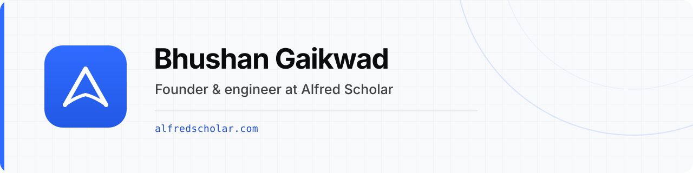

[Alfred Scholar](https://alfredscholar.com) · [LinkedIn](https://linkedin.com/in/rckstrbhushan) · [X](https://x.com/rckstrbhushan) · [Email](mailto:bhushan@alfredscholar.com)

## What I'm building

I'm building [Alfred Scholar](https://alfredscholar.com), a page-cited research workspace for scholars. It brings reading, discovery, citations, writing, and review into one place.

My work covers product decisions, application code, cloud infrastructure, operations, growth, and customer support. I also contribute fixes upstream when the tools I use can be improved.

## Current stack

- **Product:** React, TypeScript, Vite, Astro
- **Backend:** Laravel, PHP, Go, PostgreSQL
- **Infrastructure:** AWS, Cloudflare, Terraform, Docker
- **Engineering:** GitHub Actions, observability, automated testing

## How I work

I prefer simple systems, short feedback loops, and shipping useful software over unnecessary abstraction.

## Contact

For product, engineering, or open-source conversations: [bhushan@alfredscholar.com](mailto:bhushan@alfredscholar.com)
